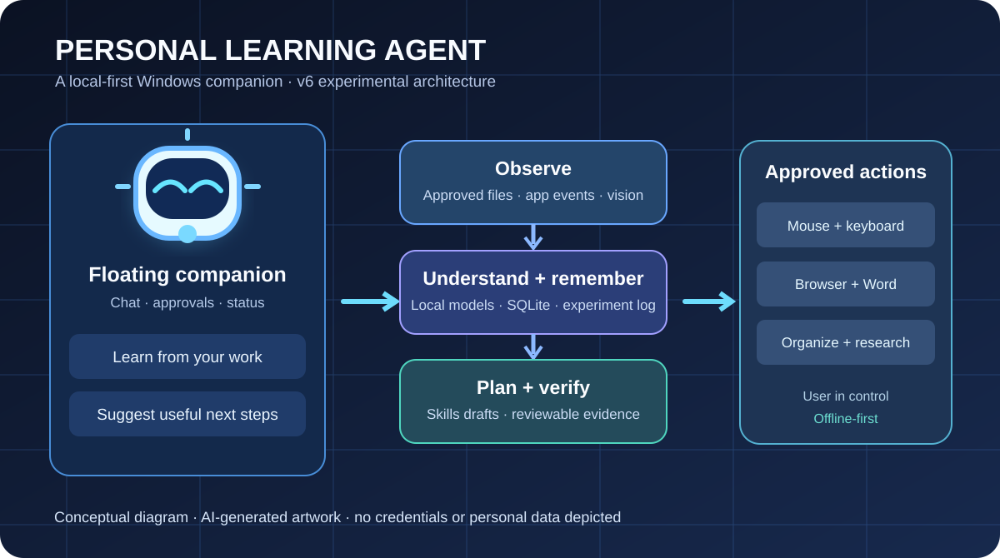

# Personal Learning Agent — Windows v6

A local-first experimental Python desktop research companion for Windows, featuring a floating assistant, optional whole-PC **user-data** discovery, a local AI model manager, browser and Word helpers, approval-based Teach + Replay workflows, automatically drafted skills, and an experiment journal.

> **Prototype status:** This is source code, **not** a precompiled Windows installer or a proven fully autonomous agent. Local model weights and compatible llama.cpp binaries must be downloaded separately. Test screen, browser, Word, mouse and keyboard features on your actual Windows PC before relying on them.

*AI-generated conceptual architecture diagram; it is not a screenshot of the actual application.*

**Publication status:** The GitHub repository currently contains the project description, community/support files and architecture figure. The complete v6 application source has not yet been uploaded here. The release ZIP shared in the ChatGPT conversation includes a Windows Git publishing helper; once it is run, the missing `pla/`, `tests/`, `docs/`, and installation files will appear here. Until then, **Code → Download ZIP is not a runnable application**.\n\n## Start on Windows

1. Install Python 3.11 or newer with Tkinter enabled.
2. Clone the repository or choose **Code → Download ZIP**.
3. Run `install.bat` to install Python dependencies, then `launch.bat` to start the companion.
4. Configure and download a supported local model in **Models + Hardware**. Ollama is not required.
5. Enable file indexing or screen learning only after reviewing the permissions. Test Teach + Replay in a harmless app such as Notepad.

Details: [Getting started](START_HERE.txt) · [Full guide](docs/README.md) · [Adaptive hardware](docs/ADAPTIVE_HARDWARE_v4.md) · [Desktop tasks](docs/DESKTOP_TASKS_v3.md) · [Teach + Replay](docs/TEACH_AND_REPLAY_v5.md) · [Skills and experiments](docs/SKILLS_AND_EXPERIMENTS_v6.md).

## What this experimental release includes

| Component | Current scope |
| --- | --- |
| Floating companion | Tkinter desktop mascot and chat controls |
| Local AI | Download/cache of quantized model weights, CPU fallback, optional GPU backends |
| Learning | Local SQLite memory and optional indexing of accessible user data |
| Work tools | Browser bridge, Word inspection, file organization previews, web and academic search |
| Desktop actions | Recorded, explicitly approved mouse/keyboard macro replay; coordinate-based and layout-sensitive |
| Skills | Automatically generated *draft* skills from indexed files; approval needed before execution |
| Experiments | Local experiment records and suggestions; generated metrics are not automatically verified |

### Testing

Run `python -m unittest discover -s tests -p "test_*.py"`. The repository contains a Windows EXE *build script*, not a precompiled installer.

## Privacy and safety

Do not commit AI model weights, private memory databases, screenshots, browser history, credentials, logs, local settings, sensitive documents, or datasets. Whole-PC discovery excludes protected system and credential areas by design; review the actual scope and your permissions. Desktop macros can click the wrong target after windows or layouts change. Web research requires connectivity; not all features work offline.

## Community

[Contribution guidelines](CONTRIBUTING.md) · [Contributors](CONTRIBUTORS.md) · [Support / sponsorship](SPONSORS.md).

**License:** A repository-level open-source license has not yet been selected. Public source availability does not automatically permit copying, redistribution, modification, or commercial use. Third-party software, AI model weights and assets have their own terms.
